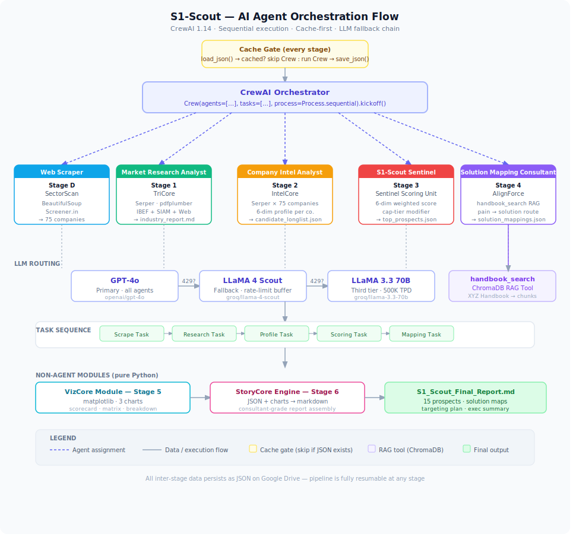
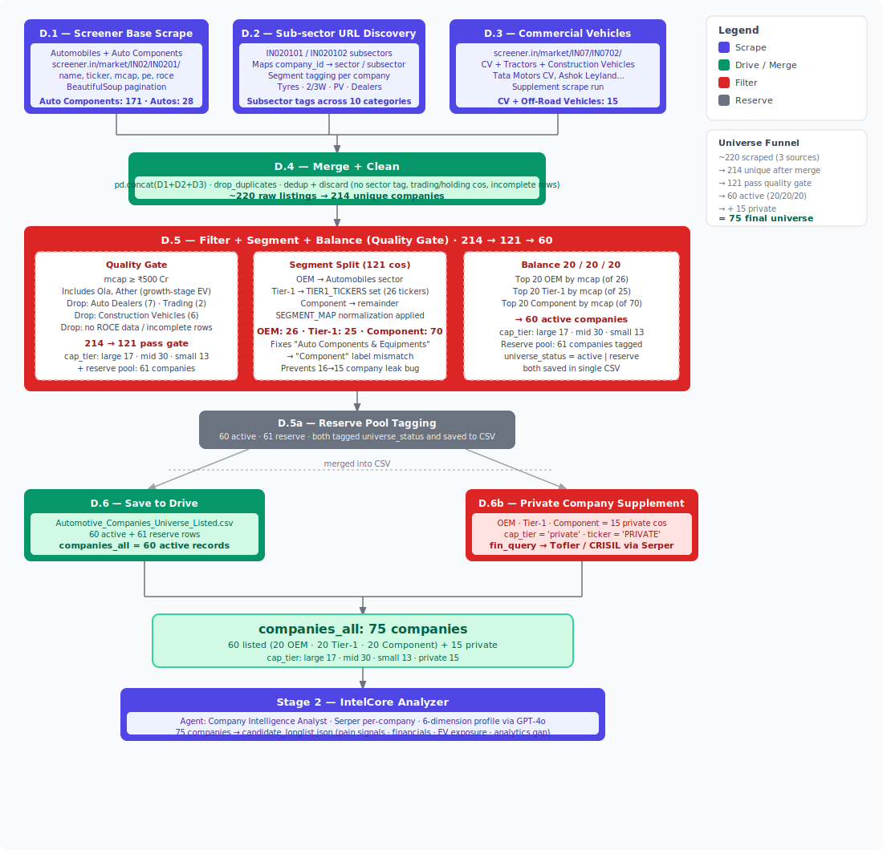

# S1-Scout: Reconnaissance for Revenue
### AI Sales Intelligence Agent for XYZ Analytics Consulting
> Hackathon Submission · Indian Automotive Market · July 2026

S1-Scout automates the top of XYZ Analytics Consulting's B2B sales funnel.
It researches the Indian automotive industry, scores a universe of 75 companies across six intelligence dimensions, and maps each company's business challenges to the most relevant consulting solution —
**Warranty Analytics**, **Supply-Risk AI**, or **Dealer & Field Service Intelligence** —
grounded in the official Product & Solutions Handbook via RAG.

---

## Quick Start (Google Colab)

1. Open `S1_Scout_Sales_Intelligence_Agent.ipynb` in Google Colab
2. Add secrets in Colab (🔑 left sidebar):
   - `OPENAI_API_KEY` — from [platform.openai.com](https://platform.openai.com)
   - `GROQ_API_KEY` — from [console.groq.com](https://console.groq.com)
   - `SERPER_API_KEY` — from [serper.dev](https://serper.dev)
3. Upload `XYZ_Analytics_Consulting_Product_Solutions_Handbook.pdf` to `My Drive/S1 Scout/`
4. **Runtime → Run All**

First run: ~45 minutes (scraping + profiling + scoring).
Subsequent runs: under 2 minutes — all intermediate outputs cached to Drive, completed stages skipped automatically.

---

## Pipeline Architecture

| Stage | Name | Agent | Tools | Output |
|---|---|---|---|---|
| 0 | BaseCore Initialization | — | pdfplumber · ChromaDB | Handbook RAG index · API config |
| D | SectorScan Engine | Web Scraper | BeautifulSoup · Screener.in | 75-company active universe |
| 1 | TriCore Intelligence Stack | Market Research Analyst | Serper · pdfplumber · GPT-4o | `industry_report.md` · `ibef_baseline.json` |
| 2 | IntelCore Analyzer | Company Intelligence Analyst | Serper · GPT-4o | `candidate_longlist.json` (75 profiles · 6 dimensions) |
| 3 | Sentinel Scoring Unit | S1-Scout Sentinel | GPT-4o · LLaMA fallback | `company_scores.json` · `top_prospects.json` (Top 15) |
| 4 | AlignForce Engine | Solution Mapping Consultant | `handbook_search` RAG · GPT-4o | `solution_mappings.json` (handbook-cited) |
| 5 | VizCore Module | — | matplotlib | `chart_scorecard.png` · `chart_matrix.png` · `chart_breakdown.png` |
| 6 | StoryCore Engine | — | — | `S1_Scout_Final_Report.md` |

> **Naming convention** — S1-Scout uses a unified "Core/Engine" taxonomy across all stages. Each name pairs a functional role with a modular suffix, making the pipeline instantly scannable and each component's purpose self-evident.

---

## Tools & Stack

| Category | Tool |
|---|---|
| Agent Framework | CrewAI 1.14 + LiteLLM |
| LLM — Primary | OpenAI `gpt-4o` |
| LLM — Fallback | Groq `meta-llama/llama-4-scout-17b-16e-instruct` |
| LLM — Third tier | Groq `llama-3.3-70b-versatile` (500K TPD) |
| Web Search | Serper API |
| RAG / Vector Store | ChromaDB (in-memory) |
| Embeddings | `all-MiniLM-L6-v2` via sentence-transformers |
| PDF Extraction | pdfplumber |
| Visualisation | matplotlib |
| Environment | Google Colab + Google Drive |

---

## Scoring Model — Sentinel Dimensions

Six weighted dimensions drive the Sentinel score (0–100):

| Dimension | Weight | What it measures |
|---|---|---|
| Pain Signal Strength | 25% | Evidence of active operational pain from public sources |
| Winnability | 20% | No confirmed incumbent analytics vendor + XYZ-fit pain |
| EV Transition Pressure | 20% | Exposure to EV disruption driving analytics urgency |
| Financial Health | 15% | Ability to fund a consulting engagement |
| Growth Momentum | 10% | M&A, capex, expansion signals |
| Analytics Gap | 10% | Operational data exists but no ML/AI layer yet |

Cap-tier modifier: `mid-cap +2pts` (evidence of decision-making agility without in-house data science scale).

---

## Company Universe

Screened from listed stocks across NSE/BSE automotive sub-industries, ACMA member directories, and SIAM OEM membership.

- **Raw universe:** Gathered 220+ companies scraped and filtered 136 companies using Mcap
- **Active universe:** 75 companies (post deduplication + active filter)
- **Top 15 prospects:** 5 OEM · 5 Tier-1 Supplier · 5 Component — minimum 3 private companies guaranteed via two-pass selection

---

## Key Design Decisions

- **Anti-fabrication rule** — every pain signal requires a Serper source URL or is flagged `no specific signal found`
- **Evidence-based winnability** — companies penalised only when an incumbent analytics vendor is confirmed in public data, not assumed by size
- **Private company floor** — two-pass selection ensures minimum 3 private companies in Top 15
- **Tri-source market intelligence** — IBEF PDFs + live Serper queries + SIAM FY2026 actuals fused by GPT-4o to prevent hallucination on headline numbers
- **Cache-first design** — every stage persists JSON to Drive; re-running is instant

---

## Known Limitations

- Web data is point-in-time; financial figures are approximate from public snippets
- Groq free tier requires rate-limit handling — fallback chain (GPT-4o → LLaMA-4-Scout → LLaMA-3.3-70b) manages this automatically
- ChromaDB index rebuilds on every Colab runtime restart (~30 sec)
- Stage 1 market report uses LLM-as-judge synthesis; a disclaimer is included in the notebook
- Private company profiles have thinner public data — pain signal confidence is lower by nature
- Serper free tier (2,500 queries) — Stage 2 consumes ~150 queries for 75 companies; full pipeline uses ~200 total. Approaching the limit will surface silent empty results, not errors — monitor usage at serper.dev
- Serper results taken as-is — no secondary validation of source credibility or recency. Pain signals reflect whatever Google surfaces at query time. Future pipeline: cross-validate against company filings (BSE/NSE announcements), LinkedIn signals, or a dedicated news API (NewsAPI / Refinitiv)

---

## Output Files

| File | Description |
|---|---|
| `industry_report.md` | Indian automotive market synthesis (EV, supply chain, regulatory) |
| `candidate_longlist.json` | 75 company profiles with 6-dimension intelligence |
| `company_scores.json` | Sentinel scores with dimension breakdown + reasoning |
| `top_prospects.json` | Final Top 15 with scores, segment, cap tier |
| `solution_mappings.json` | Per-company solution routing with handbook citations |
| `chart_scorecard.png` | Top 15 ranked bar chart |
| `chart_matrix.png` | Opportunity matrix (score vs EV pressure) |
| `chart_breakdown.png` | Dimension score breakdown for Top 15 |
| `S1_Scout_Final_Report.md` | Consultant-grade sales intelligence report |
