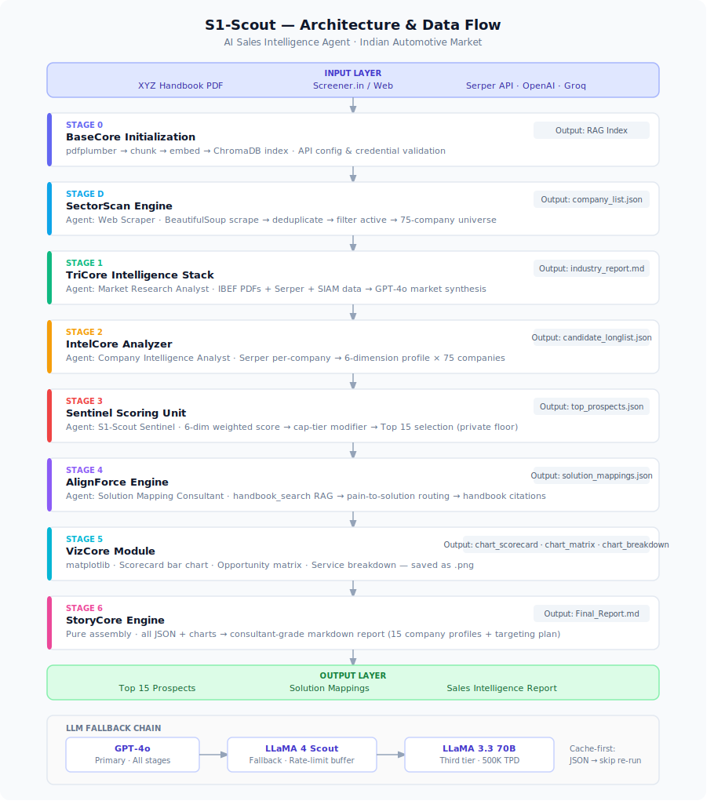

# S1-Scout: Reconnaissance for Revenue
### AI Sales Intelligence Agent for XYZ Analytics Consulting

> Hackathon Submission | Indian Automotive Market | July 2026

S1-Scout automates the top of XYZ Analytics Consulting's B2B sales funnel.
It researches the Indian automotive industry, identifies high-potential OEMs,
Tier-1 suppliers, and component manufacturers, and maps each company's
business challenges to the most relevant consulting solution —
**Warranty Analytics**, **Supply-Chain Risk Prediction**, or
**Dealer & Field Service Intelligence** — grounded in the official
Product & Solutions Handbook via RAG.

---

## Quick Start (Google Colab)

1. Open `S1_Scout_Sales_Intelligence_Agent.ipynb` in Google Colab
2. Add secrets in Colab (🔑 left sidebar):
   - `GROQ_API_KEY` — from [console.groq.com](https://console.groq.com)
   - `SERPER_API_KEY` — from [serper.dev](https://serper.dev)
3. Upload `XYZ_Analytics_Consulting_Handbook.pdf` to `My Drive/S1 Scout/`
4. **Runtime → Run All**

Full run time: ~20 minutes. All intermediate outputs cached to Drive —
re-runs skip completed stages automatically.

---

## Pipeline Architecture
| Stage | Name | Tools | Output |
|---|---|---|---|
| 0 | Knowledge Layer | pypdf · ChromaDB | Handbook RAG index (49 chunks, in-memory) |
| 1 | Market Research Agent | Serper · Groq | Industry report + 28-company long-list with pain signals |
| 2 | Company Research Agent | Serper · Groq | Structured profiles (overview · plants · financials · news) |
| 3 | Prospect Prioritization | Groq only | Top 12 shortlist — 4 OEM · 4 Tier-1 · 4 Component |
| 4 | Solution Mapping ⭐ | ChromaDB RAG · Groq | Handbook-cited recommendations per company |
| 5 | Report Generator | — | `S1_Scout_Final_Report.md` (all 4 deliverables) |

## Tools & Stack

| Category | Tool |
|---|---|
| Agent Framework | CrewAI + LiteLLM |
| LLM | Groq `llama-3.3-70b-versatile` (free tier) |
| Web Search | Serper API (Google, free tier) |
| RAG / Vector Store | ChromaDB (in-memory) |
| Embeddings | MiniLM-L6-v2 (via ChromaDB default) |
| PDF Extraction | pypdf |
| Environment | Google Colab + Google Drive |

---

## Company Universe
Screened from 210+ listed stocks across 34 Moneycontrol sub-industries,
1,000+ ACMA members, and SIAM OEM membership.
Final universe: 52 companies tagged by segment, sub-vertical, cluster, and cap tier.

## Known Limitations
- Web data is point-in-time; financial figures are approximate from public snippets
- Groq free tier (12k TPM) requires batching and rate-limit handling
- ChromaDB index rebuilds on every Colab runtime (~30 sec)
- Large-cap companies score low on winnability by design (in-house DS teams)
